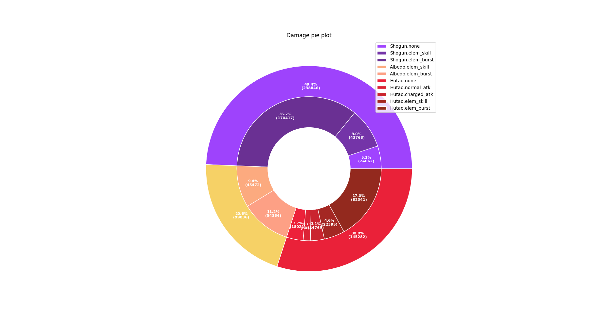

# 使用方法 Usage

_Version 0.0.0_

## 准备阶段 preparation phase

firstly, import all related modules

首先引入全部所需模块

```python
from core.simulation import *
from core.entities.character import *
from core.visualize.log_view import LogPrinter
from core.visualize.sim_view import SimPrinter
from core.visualize.exporter import Exporter
```

initialize simulation settings

初始化模拟场景

```python
simulation = Simulation()

# what you want to see in debugging
# simulation.set_show_what('warning', 'reject')

# full -> initial energy is full, tolerance -> you can elemental burst with less energy
simulation.set_energy_options(tolerance=40, full=True)

# set enemy level
simulation.set_enemy(lv=90)
```

initialize character settings

初始化队伍角色

```python
# choose character by name. set level, whether ascended
simulation.set_character('Shogun', lv=80, asc=True)

# set character normatk lv, elemskill lv, elemburst lv (omit constellation bonus level)
simulation.set_talents('Shogun', norm=6, skill=9, burst=10, cx=2)
```

initialize weapon

初始化武器

```python
w1 = Weapon()
w1.initialize('Engulfing_Lightning', lv=90, asc=False, refine=5)
simulation.set_weapon('Shogun', w1)
```

initialize artifacts with lls-format string

初始化圣遗物，可以使用 LLS 专用字符格式

（后续开发更多输入模式）

```python
art1 = Artifact()
p1 = ArtifactPiece('JUE_YUAN@FLOWER@[HP_CONST]@[ER:17,CRIT_RATE:27,CRIT_DMG:15,ATK_PER:8,]@LV20@STAR5;')
p2 = ArtifactPiece('JUE_YUAN@PLUME@[ATK_CONST]@[CRIT_DMG:17,CRIT_RATE:18,ATK_PER:23,DEF_PER:10,]@LV20@STAR5;')
p3 = ArtifactPiece('JUE_DOU_SHI@SANDS@[ER]@[CRIT_DMG:17,ATK_CONST:8,DEF_PER:24,CRIT_RATE:27,]@LV20@STAR5;')
p4 = ArtifactPiece('JUE_YUAN@GOBLET@[ATK_PER]@[ATK_CONST:8,CRIT_DMG:16,ER:14,CRIT_RATE:22,]@LV20@STAR5;')
p5 = ArtifactPiece('JUE_YUAN@CIRCLET@[CRIT_RATE]@[CRIT_DMG:18,ER:9,ATK_PER:25,EM:15,]@LV20@STAR5;')
art1.equip(p1, p2, p3, p4, p5)
simulation.set_artifact('Shogun', art1)
```

## 动作编写阶段 action phase

action operation format:

_character.command(condition)@time_ or _index.command(condition)@time_

`e.g shogun.a@3 or 1.a@3`

both uppercase and lowercase are OK.

index is determined by the order you initialize the character

动作指令格式

角色.命令(附加条件)@时间 或 编号.命令(附加条件)@时间

`e.g shogun.a@3 or 1.a@3`

忽略大小写，编号取决于你前文初始化角色的顺序

```python
cmds =  '''
        1.e@0
        2.c@1
        2.e@2
        3.c@3
        3.e@3.5
        3.a@4
        3.z@4.5
        3.a@5.5
        3.z@6
        3.q@7.5
        2.c@10
        2.q@11
        1.c@15
        1.q@16
        1.a@18
        1.z@18.5
        1.a@20
        1.z@20.5
        3.c@22
        3.e@25
        3.q@26
        '''
cmd_list = [c.strip() for c in cmds.split()]
list(map(lambda s: simulation.insert(Operation(s)),cmd_list))
```

## 可视化阶段 visualization phase

we need few modules in this phase, you can simply do what I do in the demo if you don't want to know the detail

这一阶段需要使用到一些自行编写的模块，如果不想知道细节可以直接模仿 demo

```python
numeric_controller = NumericController()

p = LogPrinter(numeric_controller)
p.paint_color(simulation)

sp = SimPrinter(simulation)

e = Exporter(simulation)
e.export_dir('./')
```

---

if you want to see how attributes of a character change in the simulation:

观察某角色各项属性的变化

```python
p.print_char_log('Shogun', ['ATK', 'ER', 'ELECTRO_DMG', 'EM'])
```


---

how energy changes in the simulation

能量变化情况

```python
p.print_energy_log()
```


---

how many damage one character makes

单角色伤害

```python
p.print_damage_one('Shogun')
```


---

how many heal one character makes

单角色治疗

```python
p.print_heal_one('Hutao')
```

---

pie plot for damage

伤害饼图

```python
p.print_damage_pie()
```



---

how much element you apply

施加元素量的统计

```python
sp.print_element()
```


---

the element aura

敌人元素附着情况

```python
p.print_element_log()
```


---

the gantt graph for action and buffs

动作和buff的甘特图

```python
stage = numeric_controller.onstage_record()
sp.print_action(['Shogun', 'Albedo', 'Hutao'], stage)
sp.print_buffs(stage)
```


for more graphs, check the demo in [examples](./src/core/demo "examples")

---

you can also export the data into csv format by Exporter, for future use in excel

同时可以把数据导出为 csv 格式以便在 excel 中使用

```python
e.export()
```
